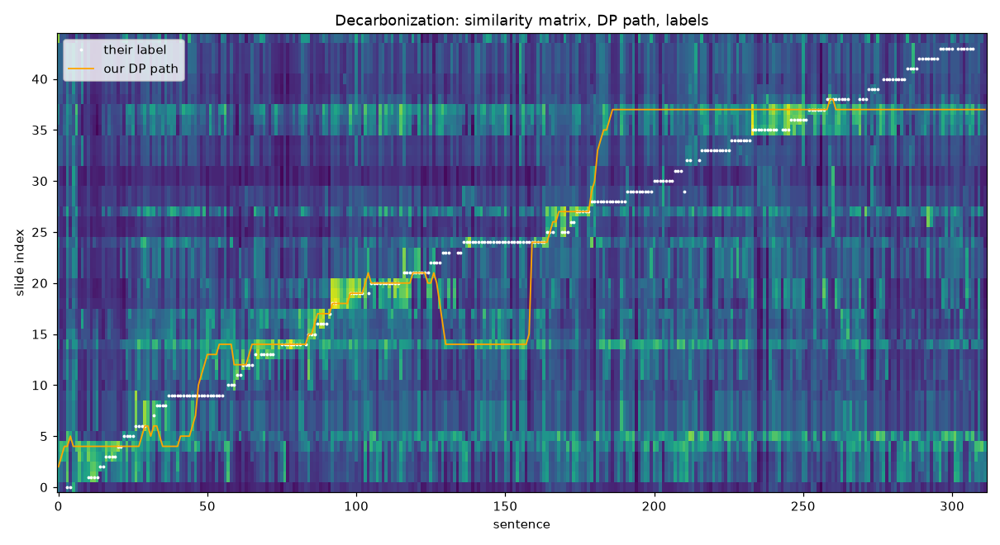

## Inspection — Decarbonization (`cities_and_decarbonization`)

their F1: dp 0.44, naive 0.39, their audio 0.52 · 312 sentences (37 unlabelled) · 45 pages, text layer full (45/45 pages with text) · GT slide range 1–44 · mean row contrast (max−mean) 0.259 · slide text: ocr

Distinct labels used: 1, 2, 3, 4, 5, 6, 7, 8, 9, 10, 11, 12, 13, 14, 15, 16, 17, 18, 19, 20, 21, 22, 23, 24, 25, 26, 27, 28, 29, 30, 31, 32, 33, 34, 35, 36, 37, 38, 39, 40, 41, 42, 43, 44

First 10 mismatches (sentence → our slide vs their label; slide texts truncated):

- s3 (t=32s) “ So let's get back to the topic for today, which is going to be cities and decarbonization.”  
  ours p6 (S=0.62): Materials for today @ James H. Williams et al. Carbon-Neutral Pathways for the United States. AGU Advances, 2(1), 2020 d  
  label p1 (S=0.54): Cities & decarbonization MIT 11.165/477, 11.286J David Hsu Associate Professor MIT DUSP September 10, 2022
- s4 (t=34s) “ What is the role of cities?”  
  ours p6 (S=0.52): Materials for today @ James H. Williams et al. Carbon-Neutral Pathways for the United States. AGU Advances, 2(1), 2020 d  
  label p1 (S=0.33): Cities & decarbonization MIT 11.165/477, 11.286J David Hsu Associate Professor MIT DUSP September 10, 2022
- s10 (t=57s) “ First, the introductory reading from last week.”  
  ours p5 (S=0.65): Preparing for class @ Introductory reading >» short & skimmable, so easy to catch up (but you should catch up!) > partic  
  label p2 (S=0.56): Preparing for class @ Introductory reading > short & skimmable, so easy to catch up (but you should catch up!) > particu
- s11 (t=62s) “ It's fairly short and skimmable, so it's easy to catch up, but you should catch up.”  
  ours p5 (S=0.59): Preparing for class @ Introductory reading >» short & skimmable, so easy to catch up (but you should catch up!) > partic  
  label p2 (S=0.73): Preparing for class @ Introductory reading > short & skimmable, so easy to catch up (but you should catch up!) > particu
- s12 (t=66s) “ And it's particularly important to look at Mackay chapter two.”  
  ours p5 (S=0.60): Preparing for class @ Introductory reading >» short & skimmable, so easy to catch up (but you should catch up!) > partic  
  label p2 (S=0.71): Preparing for class @ Introductory reading > short & skimmable, so easy to catch up (but you should catch up!) > particu
- s13 (t=69s) “ Again, it's Mackay chapter two.”  
  ours p5 (S=0.47): Preparing for class @ Introductory reading >» short & skimmable, so easy to catch up (but you should catch up!) > partic  
  label p2 (S=0.54): Preparing for class @ Introductory reading > short & skimmable, so easy to catch up (but you should catch up!) > particu
- s14 (t=73s) “ There's an initial problem set due Monday night.”  
  ours p5 (S=0.50): Preparing for class @ Introductory reading >» short & skimmable, so easy to catch up (but you should catch up!) > partic  
  label p3 (S=0.58): Preparing for class @ Introductory reading > short & skimmable, so easy to catch up (but you should catch up!) > particu
- s15 (t=78s) “ You can just access the problem set by going directly to this Google form, the link on the screen.”  
  ours p5 (S=0.52): Preparing for class @ Introductory reading >» short & skimmable, so easy to catch up (but you should catch up!) > partic  
  label p3 (S=0.40): Preparing for class @ Introductory reading > short & skimmable, so easy to catch up (but you should catch up!) > particu
- s16 (t=81s) “ You should do the reading for this week.”  
  ours p5 (S=0.66): Preparing for class @ Introductory reading >» short & skimmable, so easy to catch up (but you should catch up!) > partic  
  label p4 (S=0.65): Preparing for class @ Introductory reading >» short & skimmable, so easy to catch up (but you should catch up!) > partic
- s17 (t=82s) “ That's on the syllabus.”  
  ours p5 (S=0.60): Preparing for class @ Introductory reading >» short & skimmable, so easy to catch up (but you should catch up!) > partic  
  label p4 (S=0.54): Preparing for class @ Introductory reading >» short & skimmable, so easy to catch up (but you should catch up!) > partic
