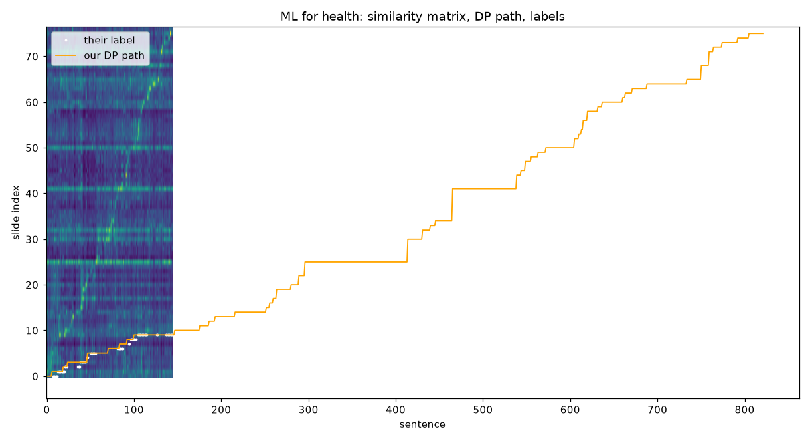

## Inspection — ML for health (`ML_for_health_MIT`)

their F1: dp 0.56, naive 0.32, their audio 0.57 · 822 sentences (333 unlabelled) · 77 pages, text layer full (77/77 pages with text) · GT slide range -2–76 · mean row contrast (max−mean) 0.280 · slide text: ocr

Distinct labels used: -2, 1, 2, 3, 4, 5, 6, 7, 8, 9, 10, 11, 12, 13, 14, 15, 16, 17, 18, 19, 20, 21, 22, 23, 24, 25, 26, 27, 28, 29, 30, 31, 32, 33, 34, 35, 36, 37, 38, 39, 40, 41, 42, 43, 44, 45, 46, 47, 48, 49, 50, 51, 52, 53, 54, 55, 56, 57, 58, 59, 60, 61, 62, 63, 64, 65, 66, 67, 68, 69, 70, 71, 72, 73, 74, 75, 76

First 10 mismatches (sentence → our slide vs their label; slide texts truncated):

- s7 (t=78s) “ So MIMIC, for those of you who don't know, has intensive care data from about 60 thousand and admissions to i”  
  ours p2 (S=0.63): Understanding clinical data * Consider the distribution of heart Careview rates in the MIMIC-III chart (as recorded in C  
  label p1 (S=0.46): Deep dive into clinical data HST.956/6.S897 @ mm §6Massachusetts | I Institute of Technology Courtesy of the . Image is 
- s8 (t=92s) “ And one of the technical difficulties that we encountered is that in the middle of that time period, the hosp”  
  ours p2 (S=0.63): Understanding clinical data * Consider the distribution of heart Careview rates in the MIMIC-III chart (as recorded in C  
  label p1 (S=0.46): Deep dive into clinical data HST.956/6.S897 @ mm §6Massachusetts | I Institute of Technology Courtesy of the . Image is 
- s9 (t=93s) “ Care view is the old one.”  
  ours p2 (S=0.50): Understanding clinical data * Consider the distribution of heart Careview rates in the MIMIC-III chart (as recorded in C  
  label p1 (S=0.36): Deep dive into clinical data HST.956/6.S897 @ mm §6Massachusetts | I Institute of Technology Courtesy of the . Image is 
- s10 (t=95s) “ MetaVision is the new one.”  
  ours p2 (S=0.50): Understanding clinical data * Consider the distribution of heart Careview rates in the MIMIC-III chart (as recorded in C  
  label p1 (S=0.36): Deep dive into clinical data HST.956/6.S897 @ mm §6Massachusetts | I Institute of Technology Courtesy of the . Image is 
- s11 (t=97s) “ And of course, they're not exactly compatible.”  
  ours p2 (S=0.50): Understanding clinical data * Consider the distribution of heart Careview rates in the MIMIC-III chart (as recorded in C  
  label p1 (S=0.36): Deep dive into clinical data HST.956/6.S897 @ mm §6Massachusetts | I Institute of Technology Courtesy of the . Image is 
- s12 (t=100s) “ So we'll see some examples of that.”  
  ours p2 (S=0.50): Understanding clinical data * Consider the distribution of heart Careview rates in the MIMIC-III chart (as recorded in C  
  label p1 (S=0.36): Deep dive into clinical data HST.956/6.S897 @ mm §6Massachusetts | I Institute of Technology Courtesy of the . Image is 
- s19 (t=129s) “ Not typical.”  
  ours p3 (S=0.48): Comparison of Careview and Metavision heart rates, outliers removed Careview 4e+05- 3e+05 - count 2e+05- te+05- Oe+00- 0  
  label p2 (S=0.44): Understanding clinical data * Consider the distribution of heart Careview rates in the MIMIC-III chart (as recorded in C
- s20 (t=141s) “ And so my initial reaction was, so then I looked a little closer.”  
  ours p3 (S=0.48): Comparison of Careview and Metavision heart rates, outliers removed Careview 4e+05- 3e+05 - count 2e+05- te+05- Oe+00- 0  
  label p2 (S=0.44): Understanding clinical data * Consider the distribution of heart Careview rates in the MIMIC-III chart (as recorded in C
- s36 (t=209s) “ So anyway, if you look at the statistics, you see that the mean heart rate in care view is 108.”  
  ours p4 (S=0.50): count Age distribution of patients with recorded heart rates, age>=90 or <1 suppressed 200000 - 150000 - 100000 - 50000   
  label p3 (S=0.57): Comparison of Careview and Metavision heart rates, outliers removed Careview 4e+05- 3e+05 - count 2e+05- te+05- Oe+00- 0
- s37 (t=213s) “ And the mean heart rate in MetaVision is 87.”  
  ours p4 (S=0.50): count Age distribution of patients with recorded heart rates, age>=90 or <1 suppressed 200000 - 150000 - 100000 - 50000   
  label p3 (S=0.57): Comparison of Careview and Metavision heart rates, outliers removed Careview 4e+05- 3e+05 - count 2e+05- te+05- Oe+00- 0
